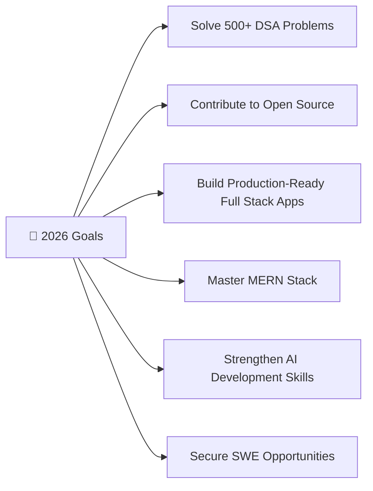

<!-- ═══════════════════════════ ANIMATED HEADER ═══════════════════════════ -->

<!-- ═══════════════════════════ TYPING ANIMATION ═══════════════════════════ -->

  

<!-- ═══════════════════════════ DEVELOPER BANNER ═══════════════════════════ -->

  

<!-- ═══════════════════════════ VISITOR + FOLLOW BADGES ═══════════════════════════ -->

  
  &nbsp;
  
  &nbsp;
  

 

<!-- ═══════════════════════════ SOCIAL BADGES ═══════════════════════════ -->

  
  
  
  

<!-- ═══════════════════════════ DIVIDER ═══════════════════════════ -->

<!-- ═══════════════════════════ ABOUT ME ═══════════════════════════ -->
##  About Me

&nbsp;

  🧑‍💻 &nbsp;<b>Aspiring Software Engineer</b> passionate about building for the real world 
  🎓 &nbsp;<b>BS in Computer Science &amp; Data Analytics (CSDA)</b> @ <b>IIT Patna</b> 
  🌏 &nbsp;Based in <b>India</b> 🇮🇳 
  🎯 &nbsp;<b>Focus:</b> DSA in C++ • Full Stack Development • AI • Open Source 
  🚀 &nbsp;<b>Goal:</b> Become a skilled Full Stack Developer &amp; Software Engineer while building impactful, real-world projects

 

- 🔭 &nbsp;I'm currently working on **AI-powered & Full Stack projects**
- 🌱 &nbsp;Deep-diving into **Advanced DSA, MERN Stack & System Design**
- 👯 &nbsp;Looking to **collaborate on Open Source** projects
- 💬 &nbsp;Ask me about **C++, JavaScript, React & Node.js**
- ⚡ &nbsp;Fun fact: **I love turning ideas into real-world solutions**

 

<!-- ═══════════════════════════ DIVIDER ═══════════════════════════ -->

<!-- ═══════════════════════════ FEATURED PROJECTS ═══════════════════════════ -->
##  Featured Projects

<table align="center">
  <tr>
    <!-- ───── PROJECT 1 : FraudShield ───── -->
    <td width="50%" valign="top" align="center">
      <h3>🛡️ &nbsp;FraudShield</h3>
      
<i>Claude AI–powered fraud detection &amp; prevention platform</i>

      

        
        
        
        
        
      

      

        A full-stack fraud detection &amp; prevention platform 
        that identifies suspicious activity and protects users from financial fraud in real time.
      

      <b>✨ Key Features</b>
      

        ✅ &nbsp;Fraud Detection 
        ✅ &nbsp;Risk Analysis 
        ✅ &nbsp;Real-Time Monitoring 
        ✅ &nbsp;User-Friendly Dashboard 
        ✅ &nbsp;AI-Based Predictions
      

      
    </td>
    <!-- ───── PROJECT 2 : LabSphere ───── -->
    <td width="50%" valign="top" align="center">
      <h3>🧪 &nbsp;LabSphere</h3>
      
<i>Web-based Chemistry Lab Inventory Management System</i>

      

        
        
        
        
        
        
      

      

        A Chemistry Lab Inventory Management System that streamlines
        inventory tracking, issuance, and day-to-day lab operations.
      

      <b>✨ Key Features</b>
      

        ✅ &nbsp;Role-Based Access Control 
        ✅ &nbsp;Inventory Tracking 
        ✅ &nbsp;Issue / Return Management 
        ✅ &nbsp;QR Code Generation 
        ✅ &nbsp;Damage Report System
      

      
    </td>
  </tr>
</table>

<!-- ═══════════════════════════ DIVIDER ═══════════════════════════ -->

<!-- ═══════════════════════════ TECH STACK ═══════════════════════════ -->
##  Tech Stack & Tools

**💻 Programming Languages**

**🎨 Frontend**

**⚙️ Backend**

**🗄️ Database**

**🛠️ Tools**

<!-- ═══════════════════════════ DIVIDER ═══════════════════════════ -->

<!-- ═══════════════════════════ GITHUB ANALYTICS ═══════════════════════════ -->
##  GitHub Analytics

  
  

  

<!-- Activity Graph -->

  

<!-- Trophies -->

  

<!-- Contribution Snake -->

  

<!--
  SNAKE SETUP: the snake.svg above only renders after you add the Snake GitHub Action.
  Create `.github/workflows/snake.yml` in your profile repo (github.com/girishivansh/girishivansh)
  using https://github.com/Platane/snk — it generates snake.svg on the `output` branch.
-->

<!-- ═══════════════════════════ DIVIDER ═══════════════════════════ -->

<!-- ═══════════════════════════ CURRENTLY LEARNING ═══════════════════════════ -->
##  Currently Learning

| 🚀 Focus Area | 📈 Status |
|:--------------|:---------:|
| Advanced Data Structures & Algorithms | `In Progress` |
| React Ecosystem | `In Progress` |
| Backend Development | `In Progress` |
| System Design Fundamentals | `In Progress` |
| Artificial Intelligence | `In Progress` |

<!-- ═══════════════════════════ DIVIDER ═══════════════════════════ -->

<!-- ═══════════════════════════ 2026 GOALS ═══════════════════════════ -->
##  2026 Goals

<!-- ═══════════════════════════ DIVIDER ═══════════════════════════ -->

<!-- ═══════════════════════════ FUN FACTS ═══════════════════════════ -->
##  Fun Facts

> 💡 &nbsp;Passionate about building **real-world solutions**
>
> 🔬 &nbsp;Love exploring **emerging technologies**
>
> 📚 &nbsp;Always **learning and improving**
>
> 🤖 &nbsp;Interested in **AI, Web Development & Software Engineering**

<!-- ═══════════════════════════ DIVIDER ═══════════════════════════ -->

<!-- ═══════════════════════════ DEV QUOTE + JOKE ═══════════════════════════ -->
##  Dev Quote of the Day

  

##  Random Dev Joke

  

<!-- ═══════════════════════════ DIVIDER ═══════════════════════════ -->

<!-- ═══════════════════════════ CONNECT WITH ME ═══════════════════════════ -->
##  Connect With Me

  
  
  
  

<!-- ═══════════════════════════ FOOTER ═══════════════════════════ -->
 

  

  ⭐ From <a href="https://github.com/girishivansh">Shivansh Giri</a> — Made with 💜 and lots of ☕

